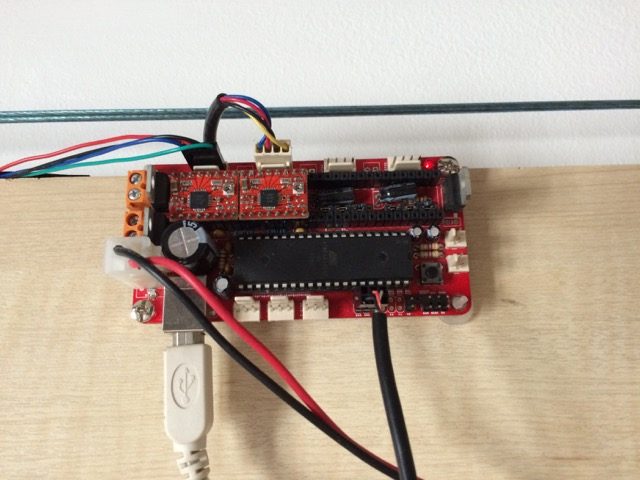

##### Makelangelo-firmware #####

http://www.makelangelo.com/

A mural drawing robot and a gentle introduction to 3D printing

Makelangelo is a polargraph mural drawing robot.  It is intended to teach students about programming, physics, trigonometry, and electronics in a fun, goal-oriented way.  Makelangelo is scalable: our test models have ranged from 30cm^2 to 300cm^2.

This project specifically deals with the firmware: the code in the brain of the robot that receives instructions and moves the motors.  It pairs really well with Makelangelo, a project to give humans a pleasant GUI.

## This Fork ##

This version of the firmware is designed for using a [Sanguinololu](http://reprap.org/wiki/Sanguinololu) board instead of a RUMBA/AMS.

Connect the two stepper motors to the X and Y controllers (left and right respectively).

The Servo is using the following connections on the EXT connector:

 * Ground
 * 5V
 * D12 PWM (actually D4 but there is an error on the PCB)

## Instructions ##

For installation instructions, see
http://learn.marginallyclever.com/index.php/Makelangelo_2_Software

Please visit the Makelangelo wiki for everything else
http://learn.marginallyclever.com/index.php/Makelangelo_3.2

For developers, please see
https://github.com/MarginallyClever/Makelangelo/wiki/Home/

## Get help ##

Please visit the forums
https://marginallyclever.com/forum

## Special thanks ##

Makelangelo is derived from the work of Paul Fisher.  It is largely inspired by "Hektor":http://hektor.ch/ by Jürg Lehni and Uli Franke.

This file was downloaded from https://github.com/MarginallyClever/Makelangelo/
